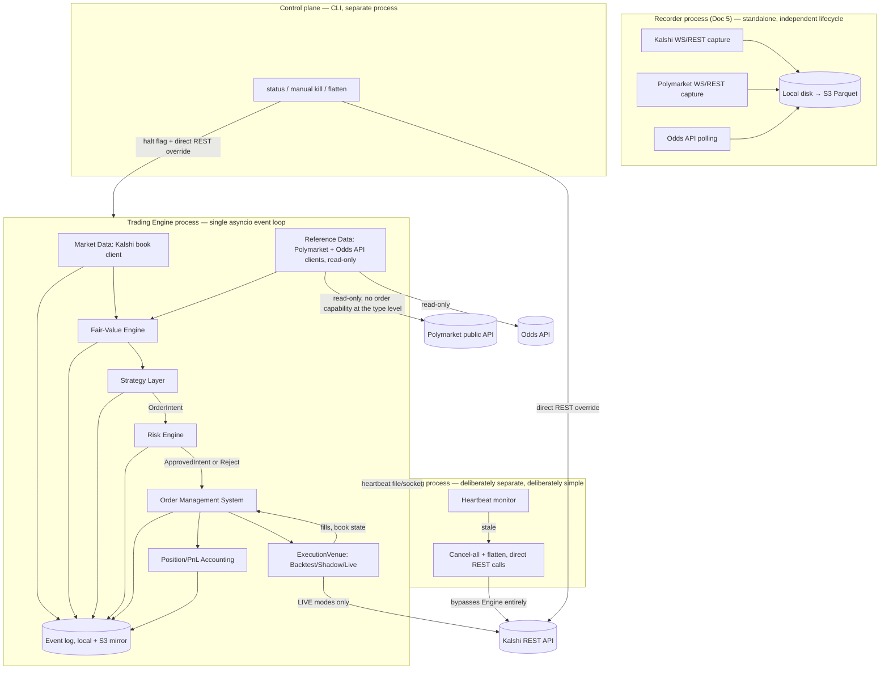

# Document 3 — System Architecture

Priority order per the brief: **safety, then clarity, then speed.** Every decision below is justified against that ordering, not against microsecond latency — the strategy shortlist in Doc 1 explicitly opts out of the latency game (in-play is killed), so there is no strategy-driven reason to pay complexity for speed here.

## 1. Stack Decision (ADR-001 summary; full ADR in Doc 10)

**Recommendation: Python 3.12+, multi-process, asyncio for I/O concurrency, Decimal/fixed-point for all money math, pydantic for typed boundaries, mypy strict for the risk/OMS path.**

Alternatives considered and rejected:

| Option | Why not, for this project specifically |
|---|---|
| Pure Python, single-process, threaded | GIL contention is a real concern only under latency pressure this project doesn't have; single-process threading *does* create real risk — a hang in one component (e.g. a slow REST call) can stall the risk engine's ability to check other strategies. Rejected in favor of multi-process, not because of the GIL, but for fault isolation. |
| Python research + C++/Rust hot path | Doubles the engineering surface area (two languages, a serialization boundary between them, two test suites) for a latency benefit this strategy profile doesn't need. This is the textbook premature optimization the brief warned against — "a system too complex to reason about at 2am" is the dominant risk at $1,000 capital and 15 hrs/week, not a few hundred microseconds of decision latency. |
| All-Rust | Strong correctness properties (no GIL, strict typing, memory safety) but a much steeper build for someone with C++-not-Rust background, and slows Phase 0 (data capture must start week 1) for no strategy-driven benefit. Revisit only if a future strategy is explicitly latency-sensitive (would require its own re-authorization per Doc 1 §3's in-play gating). |

**Why multi-process instead of single-process-with-threads:** the four highest-value properties at this capital level are (1) a recorder that never goes down because trading logic crashed, (2) a watchdog that can act even if the trading engine is wedged, (3) a risk engine that cannot be silently starved by a slow I/O call elsewhere in the same process, (4) clean process boundaries that make "what's running right now" answerable by `ps`, not by reading thread-dump output at 2am. Python's GIL is irrelevant to this reasoning — it's a fault-isolation argument, not a performance one.

**Where a hot path could be swapped in later without a rewrite:** the `ExecutionVenue` abstraction (§4) and the `FairValueEngine` interface (§3.3) are the two seams designed to allow a future Rust/C++ replacement of a single component (e.g., a latency-sensitive fair-value calculation) without touching the strategy, risk, or OMS layers — because those layers only depend on the interface, never the implementation.

## 2. Process Topology



Four OS processes: **Recorder**, **Trading Engine**, **Watchdog**, **Control CLI**. Recorder and Watchdog have no code-level dependency on the Trading Engine — they can run, and must keep running, even if the Trading Engine is down or misbehaving.

**Structural safety property:** the Reference-Data client (Polymarket + Odds API) is typed such that it has no method that can place an order — it exposes only `get_price(...) -> PriceObservation`, never anything resembling `place_order`. This isn't a policy choice enforced by discipline; it's a type that literally lacks the capability, so no strategy code path can accidentally route an order to Polymarket regardless of a bug elsewhere. Kalshi-only execution is enforced at the interface level, not just in a config flag.

## 3. Core Components

### 3.1 Market Data (Kalshi) and Reference Data (Polymarket, Odds API)

Two distinct client types, deliberately not unified into one "market data" abstraction, because they have different capability surfaces and different failure semantics:

```python
class KalshiMarketDataClient(Protocol):
    async def stream_book(self, market_ticker: str) -> AsyncIterator[BookDelta]: ...
    async def get_snapshot(self, market_ticker: str) -> BookSnapshot: ...
    # No order-placement methods on this type; execution goes through ExecutionVenue only.

class ReferenceDataClient(Protocol):
    async def get_price(self, source: Literal["polymarket", "oddsapi"], key: str) -> PriceObservation: ...
    async def stream_prices(self, source: str, keys: list[str]) -> AsyncIterator[PriceObservation]: ...
    # Deliberately has no place_order / cancel_order method — the type itself cannot execute.

@dataclass(frozen=True)
class PriceObservation:
    source: str
    key: str
    price: Decimal            # probability-equivalent, 0 < price < 1
    observed_at: MonotonicTimestamp
    exchange_ts: Optional[datetime]
    receive_ts: datetime
    staleness_budget_ms: int  # source-specific; feeds the data-staleness kill switch (Doc 4)
```

### 3.2 Order Book Maintenance

Internal book representation is exchange-agnostic (a `Book` type keyed by price level, built once, used identically across all four run modes). Invariants, checked in a debug-mode `BookInvariantChecker` run continuously in BACKTEST/SIMULATION and sampled in CANARY/PRODUCTION (full-rate checking in production is a latency cost this project doesn't need to pay, but it's never fully disabled — sampled checking still catches systematic bugs):

- Best bid < best ask at all times (crossed book is a hard error, not a warning)
- No negative sizes at any price level
- Sequence numbers strictly increasing per market; a gap triggers an explicit resync-from-snapshot, never a silent skip
- Snapshot + subsequent deltas reconstructs a book identical to an independently-fetched fresh snapshot (checked periodically by diffing against a fresh REST snapshot)

### 3.3 Fair-Value Engine

Pluggable per contract type; the sports implementation blends de-vigged sportsbook consensus and Polymarket price:

```python
class FairValueModel(Protocol):
    def estimate(self, market: MarketContext, inputs: list[PriceObservation]) -> FairValueEstimate: ...

@dataclass(frozen=True)
class FairValueEstimate:
    probability: Decimal
    uncertainty: Decimal       # feeds Kelly sizing and the min_edge_required hurdle (Doc 2 §5)
    inputs_used: list[PriceObservation]
    stale_inputs_dropped: list[str]

class SportsConsensusFairValue(FairValueModel):
    # 1. de-vig each sportsbook line (Shin method, Doc 1 §2.3) independently
    # 2. blend de-vigged consensus with Polymarket's raw price (weights are a Phase 1-tunable parameter,
    #    not hardcoded — different weighting is itself a backtestable hypothesis)
    # 3. uncertainty = f(number of live inputs, spread of de-vigged estimates, staleness of each input)
    ...
```

`uncertainty` is not decorative — it directly parameterizes both the Kelly fraction and the fading hurdle in Doc 2 §5, so a fair-value estimate built from 2 stale sportsbook lines and no Polymarket price produces a smaller position than one built from 5 fresh lines plus Polymarket agreement.

### 3.4 Strategy Layer

One interface, two categories of implementation (market-making, liquidity-taking), both just implementations of the same `Strategy` protocol — adding a second sport or a new strategy from Doc 1's shortlist is a new implementation plus configuration, not a fork of the engine:

```python
class Strategy(Protocol):
    def on_fair_value_update(self, fv: FairValueEstimate, book: Book, position: Position) -> list[OrderIntent]: ...
    def on_fill(self, fill: Fill, position: Position) -> list[OrderIntent]: ...

@dataclass(frozen=True)
class OrderIntent:
    market_ticker: str
    side: Literal["buy_yes", "sell_yes"]
    price: Decimal
    size: int
    reason: str                # human-readable, goes to the event log — every order must say why
    correlated_group: str      # e.g. game ID, used by the risk engine for fading (Doc 2 §5)
    # No method on this type reaches the OMS directly — it is only ever consumed by RiskEngine.check()
```

`Strategy4_1ConsensusMispricing`, `Strategy4_2ComplementaryArb`, `Strategy4_3ThinMarketMM` each implement this protocol independently, per Doc 1's ranked shortlist and Doc 2's per-strategy Phase 1 gate.

### 3.5 Risk Engine (mandatory pass-through)

```python
class RiskEngine:
    def check(self, intent: OrderIntent, state: RiskState) -> RiskDecision: ...

RiskDecision = ApprovedIntent | ModifiedIntent | RejectedIntent  # never a bare OrderIntent
```

The OMS's `submit` method's type signature only accepts `ApprovedIntent | ModifiedIntent` — there is no overload that accepts a raw `OrderIntent`. This is the architectural enforcement that a bug in strategy code cannot bypass risk checks: it's not that the code *shouldn't* skip the risk engine, it's that there is no code path by which it *can*. Full control catalog (per-order, per-market, portfolio, rate, P&L, data-staleness, dead-man switch, reconciliation, manual kill) is Doc 4; this document only fixes where each is enforced.

**Revised after Opus adversarial review (Doc 9) — the in-flight-exposure gap.** The original design defined `RiskState` exposure purely from *reconciled, filled* positions, re-derived from Kalshi's reported positions every 5s. The reviewer found a concrete breach: `on_fair_value_update` can return a *batch* of `OrderIntent`s (§3.4); `RiskEngine.check()` evaluating them sequentially against the same not-yet-updated `RiskState` approves all of them against a per-group cap that none of them individually breach, because none of the others' notional is visible yet — resting-but-unfilled orders are invisible to a check that only looks at filled position. Worked example: 6 batched intents at $150 each, all pass a $150 group cap check individually, all fill — a 6x breach. This also silently disables the Doc 2 §5 fade, since `size_multiplier`/`required_edge` are functions of the same stale `position` read.

**Fix, now part of the design, not an open question:** `RiskState.group_exposure(group)` is defined as **reconciled filled position + notional of every `ApprovedIntent`/`ModifiedIntent` not yet known-terminal (filled/cancelled/rejected)** — an in-flight ledger, not just a fill-derived sum. This ledger is updated **synchronously, in the same coroutine step, before control returns to the event loop** — i.e., `check()` reserves the exposure atomically as part of approving an intent, with no `await` between "decide to approve" and "record the reservation." The venue submission (`await venue.place_order(...)`) happens *after* the reservation is recorded, so a second intent evaluated during that `await` sees the first intent's reserved exposure even though it hasn't filled yet. The reservation is released (not just replaced) when the order reaches a known-terminal state, reconciling any difference against the eventual fill. This is the general rule the reviewer's A1 finding also names: **no `await` may separate a risk decision from the state mutation that makes that decision visible to the next check.**

### 3.6 Order Management System (OMS)

Single chokepoint for every order, all four modes, same code.

**State machine — revised after Opus adversarial review.** The original `NEW → ACKNOWLEDGED → (PARTIALLY_FILLED)* → FILLED | CANCELLED | REJECTED` machine was found incomplete on two counts that matter in opposite directions: it would have **mis-flagged a benign race as a reconciliation break** (over-triggering halts) and **silently under-counted a genuine double-fill** (missing a real correctness bug). Revised machine:

```
NEW → ACKNOWLEDGED → (PARTIALLY_FILLED)*  → FILLED
                    ↘ PENDING_CANCEL      → CANCELLED
                                          ↘ FILLED   (fill-before-cancel race, see below)
                    ↘ REJECTED                        (post-ack rejection: self-match, market close, etc.)
```

- **`PENDING_CANCEL` / `PENDING_REPLACE` states are explicit**, not implied — cancel and cancel-replace are async round-trips, and the machine needs a state that represents "cancel requested, not yet confirmed" to reason about what's legal during that window.
- **A fill arriving for an order in `PENDING_CANCEL` is a legal transition, not a break**: the exchange can fill an order before it processes an in-flight cancel. This is expected behavior, not evidence of a broken internal state. A reconciliation break is only raised if a fill's cumulative quantity *exceeds* the order's known resting size, or if a fill arrives for an order already in a genuinely terminal state (`FILLED`/`CANCELLED` with matching quantity/`REJECTED`) and disagrees with what's already recorded.
- **Fills are deduplicated by exchange fill-id and reconciled against Kalshi's own cumulative-filled-quantity for the order**, not summed from individual delta messages — this protects against WebSocket redelivery or out-of-order fill messages double-counting a position, which the original design didn't address for fills (only for book deltas, §3.2).
- **A late/duplicate terminal message is a no-op if it agrees with already-known state, and only a break if it disagrees** — the original "any transition after terminal = break" was stricter than necessary and would have generated false halts under ordinary redelivery.

- `client_order_id` is a deterministic hash of `(strategy_name, correlated_group, intent_reason, nonce)`, where **`nonce` is defined as a monotonic per-session counter, uniqueness enforced by the client, not derived from intent content or a timestamp** — the reviewer flagged that an underspecified `nonce` either collides two legitimately distinct orders (if derived purely from content) or fails to dedupe a retry (if it changes on every attempt). The hash is used for retry-dedup within a bounded window (the OMS remembers recently-submitted `client_order_id`s and treats a resubmission with the same id as the original retry, not a new order), not as a general-purpose order identifier.
- Reconciliation against Kalshi's own reported open orders/positions on every heartbeat and unconditionally on startup — **the OMS never assumes flat on boot.**

### 3.7 Position/PnL Accounting

Mark-to-market and realized, tracked per contract / per correlated group / global. Reconciles against Kalshi's own reported position on every heartbeat; any divergence is a hard alert, not a soft warning (Doc 4).

### 3.8 Persistence & Telemetry

Every tick, decision, order, fill, and rejection is written to an append-only local event log (same format used for BACKTEST replay input, so a captured CANARY session can be replayed deterministically — this is the regression backbone described in Doc 6). Mirrored to S3 on a short delay, same pipeline as the Recorder (Doc 5) for consistency.

### 3.9 Control Plane

CLI reads Trading Engine status from the event log / a small local status file (not by reaching into the Engine's in-memory state — the Engine could be wedged). Manual kill writes a halt flag the risk engine polls every cycle **and** independently calls Kalshi's cancel-all/flatten REST endpoints directly, so a manual kill works even if the Engine process is completely unresponsive.

## 4. The Four Run Modes — One Strategy Implementation

Enforced via a single injected `ExecutionVenue` dependency, chosen once at process startup, never branched on inside strategy code:

```python
class ExecutionVenue(Protocol):
    async def place_order(self, order: ApprovedIntent) -> OrderAck: ...
    async def cancel_order(self, order_id: str) -> None: ...
    async def get_fills(self) -> list[Fill]: ...
    async def get_book(self, market_ticker: str) -> Book: ...

def build_venue(mode: RunMode, config: EngineConfig) -> ExecutionVenue:
    match mode:
        case RunMode.BACKTEST:   return BacktestVenue(config.replay_source, config.fill_model)
        case RunMode.SIMULATION: return ShadowVenue(config.live_kalshi_feed, config.fill_model)
        case RunMode.CANARY:     return KalshiLiveVenue(config.kalshi_creds, size_cap=config.canary_cap)
        case RunMode.PRODUCTION: return KalshiLiveVenue(config.kalshi_creds, size_cap=config.production_cap)
```

`CANARY` and `PRODUCTION` are **the same `KalshiLiveVenue` class** — they differ only in the risk-engine-enforced size cap passed via config, not in code path. This directly satisfies the requirement that canary validates "sim and reality agree" using the identical execution code that will run at scale.

**BACKTEST fill model — pessimistic by default, configurable aggressiveness:**
- Do we cross the spread? Only if the backtested order's price would have crossed the *recorded* opposing best price at that timestamp — never assume a resting order at the same price as an aggressive fill would have been hit.
- Queue priority: default-pessimistic assumption is **back of queue** at a given price level (worst case) with an optional, clearly-labeled "optimistic" setting (front of queue) purely for sensitivity analysis — Phase 1's gate (Doc 2 §2) requires the strategy to clear its bar under pessimistic settings, and separately reports how sensitive the result is to this assumption.
- Queue position decay: modeled as a function of observed cancel/replace activity at that price level in the recorded data, not assumed static.

**SIMULATION (shadow) — the mode the brief cares most about.** Connects to the live Kalshi market-data feed, runs the real strategy and risk engine unmodified, maintains its own shadow order book of hypothetical resting orders, and simulates fills against real trade prints and book movement — but the `ShadowVenue.place_order` never calls Kalshi's order-entry API. Documented optimism risk: **the classic failure is assuming a hypothetical resting order would have been filled at the front of the queue on a print that only had one lot of size** — `ShadowVenue` defaults to the same pessimistic queue-position assumption as `BacktestVenue`.

**Revised after Opus adversarial review — pessimistic queue position is necessary, not sufficient.** The reviewer found the original design conflated "pessimistic" with "back-of-queue only" and identified three further, independent sources of optimism that queue position alone doesn't fix:

1. **Latency was unmodeled (the single highest-impact finding of the review).** The original design evaluated a hypothetical order against the live feed at the instant the strategy decided to act — zero transit delay. In live CANARY, the order takes real time to reach Kalshi, during which price can move, often adversely (a real order gets filled precisely when the market is running through its level, which is the least favorable time). Unmodeled latency means shadow mode systematically over-states fill rate and under-states adverse selection relative to CANARY, so a strategy can pass the Phase 2 gate (Doc 2 §2) on a shadow result that CANARY then fails to reproduce — burning real canary capital to rediscover a gap the simulation should have caught. **Fix: every shadow order is stamped with a modeled latency sampled from a measured RTT distribution (collected once Kalshi round-trip timing is observable, even in BACKTEST/early SIMULATION using conservative placeholder figures), and fill evaluation happens against book/print state at `signal_ts + modeled_latency`, not at `signal_ts`.**
2. **A single real trade print was implicitly available to fill more than one hypothetical order.** A market-making strategy quoting both a hypothetical bid and a hypothetical ask at the same price can have naive logic credit one real print as evidence of *both* legs filling — impossible in reality, since one real counterparty can't trade against two of the operator's orders simultaneously. **Fix: each print consumes size exactly once, allocated to at most one shadow order (by price/time priority among the shadow book's own resting orders), and total shadow fills attributed to a given print can never exceed the print's actual size.**
3. **The shadow order's own queue-decrement across repeated evaluation, and its exclusion from real depth, were underspecified.** Per-price-level consumed-size must be tracked explicitly so a partially-filled shadow order doesn't get re-offered the same real depth on the next evaluation (which would inflate fill rate), and the shadow order itself must never be treated as real supporting depth for a different hypothetical decision.

Every shadow fill is now tagged with a **fill-model-assumptions vector** (queue position, modeled latency, print-allocation outcome, self-exclusion state) rather than a single queue-position flag, so the Phase 2 gate's "sim fill rate vs. plausible range" check and the Phase 3 sim-vs-live divergence report can attribute *which* assumption a gap traces back to, not just that a gap exists.

**CANARY.** Real orders, real money, hard-capped at single-contract size and a tight global loss limit (Doc 4 default values). Its entire purpose is producing the **sim-vs-live divergence report**: for every signal that fired, log both what `ShadowVenue` predicted (fill/no-fill, price, slippage) and what `KalshiLiveVenue` actually did, and report the distributions side by side. A large divergence is a stop signal (Doc 2 §2 Phase 3 gate), not something to explain away.

**PRODUCTION.** Same code as CANARY, larger risk-engine-configured caps, gated by the reinvestment policy (Doc 2 §7).

## 5. Threading/Async/Process Model — Explicit Statement

- **Across processes:** OS-level isolation (Recorder, Engine, Watchdog, Control CLI), communicating via the filesystem (event log, heartbeat file, halt flag) and, for the Watchdog's kill action, directly via Kalshi's REST API — deliberately not routed back through the Engine, so a wedged Engine cannot block a kill.
- **Within the Engine process:** a single asyncio event loop. All I/O (Kalshi WS/REST, Polymarket/Odds API polling) is async; all risk/OMS/accounting logic is synchronous, in-process, single-threaded by construction. If a future component genuinely needs true parallelism (e.g., a CPU-bound backtest sweep across many parameter sets), that runs as a **separate batch process** reading the same event-log/Parquet data, not inside the live Engine.
- **Backpressure:** if the async event loop falls behind (e.g., a burst of book updates), the Market Data client drops to snapshot-resync rather than processing a growing backlog of stale deltas — staleness is surfaced to the data-staleness kill switch (Doc 4) rather than silently processing outdated state as if it were current.

**Correction after Opus adversarial review — single-threaded is not race-free.** The original text claimed single-threading "eliminates an entire class of concurrency bugs at zero cost." The reviewer correctly identified this as conflating **thread-safety** (true — no preemptive interleaving) with **race-freedom** (false — cooperative interleaving at `await` points is still a real hazard). Every `await` is a yield point: between `await venue.place_order(...)` being issued and its result returning, other coroutines (a WebSocket message handler, another strategy's signal, the risk-engine's own halt-flag poll) run to completion and can observe or mutate state the paused coroutine assumed was still current. This is the same underlying mechanism as the in-flight-exposure race described in §3.5. **The binding rule, stated explicitly rather than left implicit: no `await` may separate a risk/OMS decision from the synchronous state mutation that makes that decision visible to the next evaluation.** Where an `await` is unavoidable between a check and its consequence (e.g. the actual network call to place an order), any state read before the `await` must be treated as provisional and is not re-trusted after resumption without re-validation (e.g., a version/sequence number on `RiskState` checked on resume). This is a correctness invariant the test suite (Doc 6) must exercise directly (concurrent-intent property tests), not just a comment in the code.

**Filesystem IPC — hardened after review.** The heartbeat file and halt flag are the most safety-critical channel in the system (the Watchdog's only signal, and the CLI's belt-and-suspenders kill path) and the original design under-specified their write semantics, leaving them vulnerable to the same class of failure they exist to catch. Concretely: (1) both are written via **write-to-temp-file + `fsync` + atomic rename**, never an in-place write, so a crash mid-write can never leave a corrupt or partially-written file behind; (2) both live on a **small, separate volume/directory from the bulk event log**, so a disk-full condition caused by high-volume event logging cannot also block heartbeat/halt-flag visibility — the two failure domains are kept apart on purpose; (3) the heartbeat is treated as the primary channel with a future upgrade path to a local socket-based heartbeat if file-write latency is ever observed to matter (not expected at this message rate, but the seam is left open rather than asserting the file channel is sufficient forever).

## 6. What This Document Deliberately Does Not Specify

Deployment target, secrets management mechanics, and CI/CD are Doc 7. Every control's default value and test is Doc 4/Doc 6. This document fixes structure and interfaces; it does not fix strategy parameters (Doc 1/2) or infra choices beyond the process topology.
